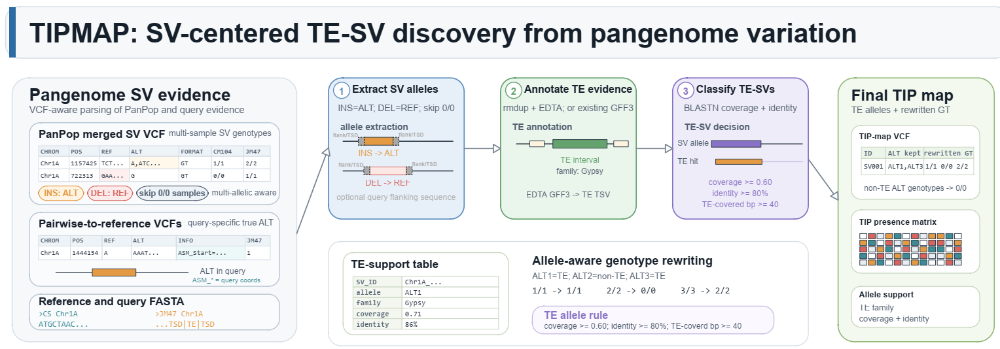
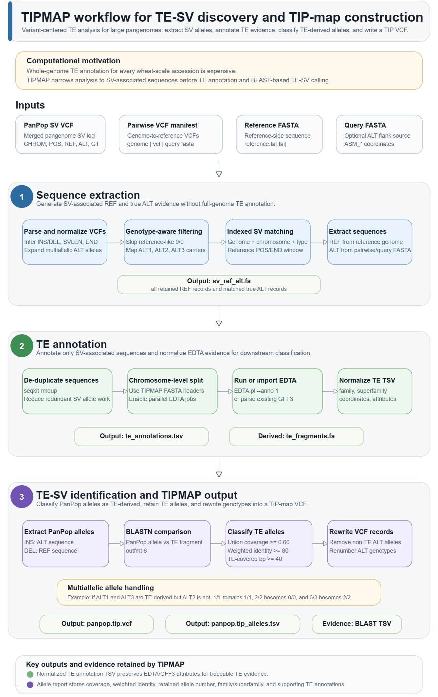

  

# TIPMap

TIPMap identifies transposable-element-derived structural variants (TE-SVs) and
constructs transposable element insertion polymorphism (TIP) maps from pangenome
structural variation datasets.

The current workflow is designed for PanPop-style merged SV VCFs plus
pairwise genome-to-reference VCFs. Only `INS` and `DEL` records are used.



## Design Motivation

Large, TE-rich genomes such as wheat make whole-genome TE annotation for every
accession expensive in both wall time and compute resources. A common brute-force
strategy is to annotate each assembled genome, build or reuse a TE library, and
then compare every SV sequence against TE evidence. For population-scale
pangenomes, this can quickly become the dominant bottleneck.

TIPMap is designed to reduce that cost. It first narrows the search space to
PanPop-supported SV alleles and their matched pairwise true ALT evidence, then
runs TE annotation and BLAST-based classification on these SV-associated
sequences. The goal is to build a TIP map from the variation dataset directly,
without requiring full TE annotation of every large query genome.

##  Workflow

 

## What TIPMap Does

- Parses PanPop merged SV VCFs and pairwise genome-to-reference VCFs.
- Uses PanPop genotypes to decide which genomes carry each ALT allele.
- Matches PanPop SV alleles to pairwise true ALT calls with an indexed
  chromosome/type/position lookup.
- Extracts reference-side SV sequence and all matched true ALT sequences.
- Preserves pairwise `ASM_*` fields as query-genome coordinates, not reference
  coordinates.
- Limits TE analysis to SV-associated sequences instead of requiring full TE
  annotation for every query genome.
- Runs TE annotation with `seqkit rmdup` plus chromosome-parallel EDTA jobs.
- Parses user-supplied EDTA GFF3 outputs when annotation was run outside TIPMap.
- Classifies PanPop alleles as TE-derived by BLASTN union coverage, weighted
  identity, and minimum TE-covered length.
- Writes a TIP-map VCF with non-TE ALT alleles removed and genotypes rewritten.
- Writes an allele-level report with TE evidence and supporting GFF3-derived
  annotation details.

## Repository Layout

```text
TIPMap/
|-- extract_sv_sequences.py        # PanPop/pairwise sequence extraction
|-- annotate_te.py                 # seqkit rmdup + EDTA + TSV export
|-- classify_te_sv.py              # BLASTN-based TE-SV classification and TIP VCF writing
|-- scripts/
|   |-- parse_edta_gff3.py         # standalone EDTA GFF3 to TSV parser
|   |-- extract_panpop_alleles.py  # helper: INS ALT / DEL REF FASTA extraction
|   `-- extract_te_fragments.py    # helper: TE fragment FASTA extraction from annotation TSV
|-- src/tipmap/lib/
|   |-- parser.py                  # VCF parsing and INS/DEL normalization
|   |-- matcher.py                 # PanPop-to-pairwise matching and sequence extraction
|   |-- fasta.py                   # FASTA/FAI helpers
|   |-- models.py                  # shared typed data models
|   |-- logger.py                  # logging helpers
|   `-- utils.py                   # small reusable helpers
|-- docs/
|   ...
`-- tests/
```

## Installation

TIPMap is a Python package with typed library modules and command-line scripts.
Python 3.12 is recommended for the current development environment; the package
metadata allows Python 3.8+.

```bash
git clone https://github.com/bingochenbin/TIPMAP.git
cd /path/to/TIPMAP
python -m pip install -e .
```

If you run scripts directly from a checkout without installing the package, set
`PYTHONPATH` to `src`:

```bash
export PYTHONPATH=src
python extract_sv_sequences.py --help
```

External tools are required for the full workflow:

- `seqkit` for sequence de-duplication in `annotate_te.py`.
- `EDTA.pl` for TE annotation in `annotate_te.py`.
- `blastn` from BLAST+ for TE-SV classification in `classify_te_sv.py`.

## Input Data

TIPMap combines two VCF sources.

### PanPop Merged SV VCF

The PanPop VCF defines pangenome SV loci in reference coordinates. TIPMap uses:

- `CHROM`, `POS`, `ID`, `REF`, and `ALT`.
- inferred `INS`/`DEL` type and SV length.
- multi-sample `GT` fields to decide which genomes carry each ALT allele.

PanPop alleles may already contain sequence, but these alleles can be normalized
or merged representations. For final true ALT sequence extraction, TIPMap can
recover sample-specific ALT sequences from pairwise VCFs.

### Pairwise Genome-to-Reference VCFs

Pairwise VCFs provide true sample-specific ALT sequences. These VCFs are usually
single-sample. TIPMap treats each pairwise record as an ALT call and does not
retain the pairwise genotype in the extracted FASTA.

Pairwise `ASM_Chr`, `ASM_Start`, `ASM_End`, and `ASM_Strand` fields describe the
ALT sequence position in the query genome assembly. They are not reference
coordinates and are not used for PanPop-to-pairwise coordinate matching.

### Pairwise Manifest

For many pairwise VCFs, use `--pairwise-vcf-list`. The manifest is tab-delimited
with two or three columns:

```text
genome  vcf_path  query_fasta_path
JM47    vcfs/JM47_vs_ref.vcf    genomes/JM47.fa
Z8425B  vcfs/Z8425B_vs_ref.vcf  genomes/Z8425B.fa
```

The third column is optional. When query FASTA paths are provided, TIPMap can use
`ASM_*` coordinates to extract true ALT sequence with query-side flanking bases.
Blank lines and lines beginning with `#` are ignored. Relative paths are resolved
relative to the manifest file.

## End-to-End Workflow

### 1. Extract SV Sequences

`extract_sv_sequences.py` extracts sequence evidence from the PanPop VCF and
matched pairwise VCFs.

```bash
python extract_sv_sequences.py \
  --panpop-vcf panpop.sv.vcf \
  --pairwise-vcf-list pairwise_vcfs.tsv \
  --reference-fasta reference.fa \
  --output sv_ref_alt.fa \
  --reference-genome CS \
  --max-distance 500 \
  --max-length-ratio-difference 0.3 \
  --flank 50 \
  --alt-flank 50 \
  --min-panpop-sequence-length 50 \
  --fasta-index-mode auto \
  --chunk-size 500 \
  --workers 16
```

Output FASTA records include:

- `ref` records from the reference genome.
- `alt` records from matched pairwise VCFs.

Filtering by `--min-panpop-sequence-length` uses the original PanPop allele
length before any flank extension. For `INS`, the PanPop ALT allele length is
used. For `DEL`, the PanPop REF allele length is used. Short REF alleles do not
block long ALT extraction, and short ALT alleles do not block long REF extraction.

`--workers` parallelizes pairwise VCF parsing and per-SV sequence extraction.
Use `--workers 1` for deterministic serial debugging.

### 2. Annotate TE Sequences

`annotate_te.py` de-duplicates extracted sequences with `seqkit rmdup`, splits
the de-duplicated FASTA by chromosome from TIPMap FASTA headers, runs EDTA per
chromosome, and writes a normalized TE annotation TSV.

```bash
python annotate_te.py sv_ref_alt.fa \
  --output te_annotations.tsv \
  --workdir te_annotation_work \
  --seqkit seqkit \
  --edta EDTA.pl \
  --species others \
  --edta-threads 8 \
  --chrom-workers 4 \
  --edta-arg="--curatedlib curated_TE_library.fa" \
  --edta-arg="--sensitive 1"
```

Each `--edta-arg` value is split with shell-like parsing before being passed to
`EDTA.pl`. Use one quoted `--edta-arg` per EDTA option group.

`annotate_te.py` always ensures EDTA annotation mode is enabled. If the user
adds `--edta-arg "--anno 1"`, the duplicate setting is ignored. If the user adds
`--edta-arg "--anno 0"`, TIPMap warns and continues with annotation enabled.

The TE annotation TSV contains:

```text
seq_id  md5  chrom  start  end  strand  source  type  family  class  attributes
```

### 3. Parse Existing EDTA GFF3 Outputs

If EDTA was run manually, skip `annotate_te.py` and parse the existing GFF3 files:

```bash
python scripts/parse_edta_gff3.py \
  --edta-dir my_edta_outputs \
  --output te_annotations.tsv
```

Explicit files can also be supplied:

```bash
python scripts/parse_edta_gff3.py \
  --gff3 sample1.EDTA.TEanno.gff3 \
  --gff3 sample2.EDTA.TEanno.gff3 \
  --output te_annotations.tsv
```

Directory scanning is top-level only and deterministic. For each `--edta-dir`,
TIPMap uses the first non-empty pattern group, de-duplicates paths, and sorts
the final file list:

1. `*EDTA.TEanno.gff3`
2. `*TEanno*.gff3`
3. `*EDTA*.gff3`
4. `*.gff3`
### 4. Classify TE-SVs and Build the TIP Map

`classify_te_sv.py` is the main TIP-calling entrypoint. It extracts PanPop
alleles, extracts annotated TE fragments, runs BLASTN, classifies TE-derived
alleles, and writes the TIP-map VCF.

```bash
python classify_te_sv.py \
  --panpop-vcf panpop.sv.vcf \
  --sv-fasta sv_ref_alt.fa \
  --te-annotations te_annotations.tsv \
  --output-vcf panpop.tip.vcf \
  --allele-report panpop.tip_alleles.tsv \
  --workdir tipmap_classify_work \
  --blast-threads 16 \
  --blast-evalue 1e-5 \
  --min-te-coverage 0.60 \
  --min-identity 80 \
  --min-te-covered-bp 40
```

Internally, PanPop alleles are extracted for classification as:

- `INS`: each PanPop ALT allele.
- `DEL`: the PanPop REF allele once per record.

The internal BLAST workflow builds a nucleotide database from extracted TE
fragments, then runs BLASTN against that database with outfmt 6:

```bash
makeblastdb -in te_fragments.fa -dbtype nucl -out te_fragments_db
blastn -query panpop_alleles.fa \
  -db te_fragments_db \
  -evalue 1e-5 \
  -num_threads 16 \
  -out panpop_allele_vs_te.tsv \
  -outfmt "6 qseqid sseqid pident length mismatch gapopen qstart qend sstart send evalue bitscore"
```

`classify_te_sv.py` also writes `panpop_alleles.index.tsv` in the workdir so
PanPop allele MD5 values can be reused while rewriting the TIP-map VCF.

If BLASTN was already run separately, reuse it with `--blast-tsv`:

```bash
python classify_te_sv.py \
  --panpop-vcf panpop.sv.vcf \
  --blast-tsv panpop_allele_vs_te.tsv \
  --te-annotations te_annotations.tsv \
  --output-vcf panpop.tip.vcf \
  --allele-report panpop.tip_alleles.tsv
```

## PanPop-to-Pairwise Matching Rule

A pairwise ALT is treated as a true ALT candidate for one PanPop SV allele only
when all of the following are true:

- same reference chromosome,
- same inferred SV type (`INS` or `DEL`),
- pairwise ALT is a real sequence, not symbolic, missing, or breakend,
- the pairwise genome carries the corresponding PanPop ALT allele,
- `abs(PanPop.POS - Pairwise.POS) <= max_distance`,
- `abs(PanPop.END - Pairwise.END) <= max_distance`,
- length difference ratio is within `max_length_ratio_difference`.

For speed, pairwise records are indexed once by `(genome, chromosome, SV type)`.
Each bucket is sorted by reference `POS`; lookup first uses binary search to keep
only records within the PanPop position window, then applies the full matching
rule.

PanPop genotype interpretation:

```text
0/0  -> reference-like; skip this genome for this SV allele
1/1  -> carries ALT1
2/2  -> carries ALT2
```

For multi-allelic PanPop records, each ALT allele is expanded into a separate
`SVRecord` with its own `allele_index`.

## TE-SV Classification Rule

For each PanPop allele sequence, TIPMap merges BLASTN query intervals with union
coverage. An allele is classified as TE-derived when:

```python
is_te_allele = (
    TE_covered_bp / allele_length >= 0.60
    and weighted_identity >= 80
    and TE_covered_bp >= 40
)

weighted_identity = sum(aligned_length * identity) / sum(aligned_length)
```

The default thresholds can be changed with `--min-te-coverage`,
`--min-identity`, and `--min-te-covered-bp`.

For multi-allelic records, only TE-derived ALT alleles are retained in the output
VCF. Genotypes are rewritten to the new ALT numbering. For example, if original
ALT1 and ALT3 are TE-derived but ALT2 is not, `1/1` remains `1/1`, `2/2` becomes
`0/0`, and `3/3` becomes `2/2`.

For deletions, a TE-derived REF allele is represented by retaining the deletion
ALT allele and marking the record with `TIP_TE_REF=1`.

## Outputs

### Extracted Sequence FASTA

`extract_sv_sequences.py` writes a FASTA containing reference-side and matched
ALT sequence evidence. FASTA headers encode TIPMap fields such as sequence role,
genome, chromosome, position, SV type, and MD5.

### TE Annotation TSV

`annotate_te.py` and `scripts/parse_edta_gff3.py` write the same normalized TSV
schema:

```text
seq_id  md5  chrom  start  end  strand  source  type  family  class  attributes
```

### TIP-map VCF

`classify_te_sv.py` writes a VCF containing TE-SV/TIP candidate records. INFO
fields added by TIPMap include:

- `TIPMAP`: record retained by TIPMap as a TE-SV/TIP candidate.
- `TIP_TE_REF`: `1` if the REF allele is classified as TE-derived.
- `TIP_TE_ALTS`: original 1-based ALT allele numbers classified as TE-derived.
- `TIP_RETAINED_ALTS`: original 1-based ALT allele numbers retained in the TIP
  VCF record.

### Allele Report TSV

The optional allele report stores one row per evaluated allele, including:

- PanPop record ID, chromosome, position, SV type, and allele role.
- original and rewritten allele number.
- allele length, MD5, TE-covered bases, union coverage, and weighted identity.
- retained status and TE family/class.
- `supporting_te_annotations`, which preserves BLAST subject, query interval,
  identity, TE coordinates, strand, type, family, class, and raw GFF3
  attributes from the TE annotation TSV.

## Development

Run the test suite with the project environment:

```bash
python -m unittest discover -s tests -v
```

Current tests cover VCF parsing, PanPop genotype handling, pairwise matching,
FASTA/FAI extraction, multiprocessing sequence extraction, EDTA GFF3 parsing,
TE annotation command construction, and BLAST-based TIP classification.

## Notes and Limitations

- TIPMap currently focuses on `INS` and `DEL`; other SV types are ignored or
  normalized to `unknown` during parsing.
- Pairwise `ASM_*` fields are query-genome coordinates. They can guide query
  ALT flank extraction.
- Representative ALT selection is intentionally left to downstream policy; the
  extraction stage preserves all matched ALT evidence.
- Classification operates on PanPop allele sequences (`INS` ALT and `DEL` REF)
  against TE fragments extracted from TE annotation results.

##  How to access help

Please don't hesitate to leave a message at github [`Issues`](https://github.com/bingochenbin/TIPMAP/issues) if you encounter any bugs or issues.  We will try our best to deal with all issues as soon as possible. In addition, if any suggestions are available, feel free to contact: **_Bin Chen_** [a1030539294@gmail.com](mailto:a1030539294@gmail.com).

##  Citation


